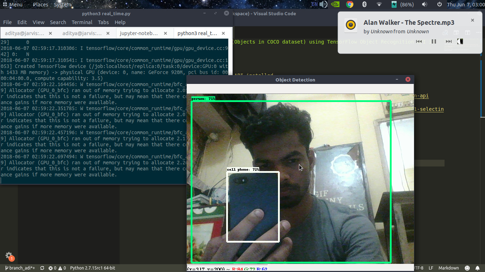

## Classifying Daily Objects (Objects in COCO dataset) using TensorFlow Object Recognition API in real time.

### Requirement
* tensorflow 1.5+
* Tensorflow Object Detection API installed

Steps to install Object Detection API can be found here
* https://github.com/adimyth/Object_Detection#step-5-installing-tensorflow-object-detection-api
* https://medium.com/@WuStangDan/step-by-step-tensorflow-object-detection-api-tutorial-part-1-selecting-a-model-a02b6aabe39e

### Running the script
```
git clone https://github.com/adimyth/tensorflow_object_detection.git
python3 real_time.py
```

### Result
